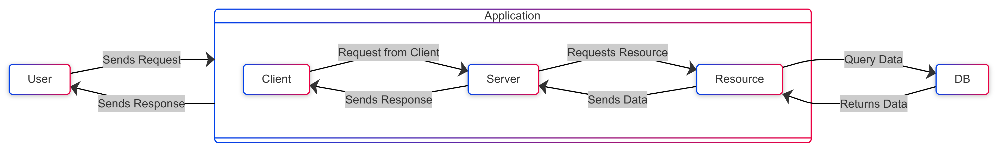

# Spring VS Spring boot
1. The traditional Spring Framework requires manual configuration.
2. Everything needs to be specified in the configuration file before designing the application.
3. Spring Boot is auto-configured, and everything for the configuration can be done using annotations like `@<Annotation_Name>`.
4. Spring Boot simplifies dependency management with its starter templates.
5. It provides embedded servers like Tomcat or Jetty, eliminating the need for external server setup.
6. Spring Boot includes production-ready features such as metrics, health checks, and externalized configuration.

# Typical Web App

# Spring's MVC
1. Spring uses servlets which run on the Tomcat server.
2. It follows the Model-View-Controller (MVC) design pattern.
3. Spring MVC provides a clear separation between the business logic, presentation logic, and navigation logic.
4. It supports various view technologies like JSP, Thymeleaf, and FreeMarker.
5. Spring MVC is highly configurable via XML or annotations.

# Spring Boot's Flexibility

1. **Auto-Configuration**  
   Spring Boot automatically configures many components, including a pre-configured Tomcat server, allowing easy deployment of web applications without manual setup. It can also auto-configure Jetty or Undertow as alternatives to Tomcat, enhancing flexibility in choosing the server.

2. **Controller Layer**
   - **Annotation-Based Controllers**: Simplifies the creation of RESTful web services through annotation-based controllers (`@RestController`, `@RequestMapping`), reducing boilerplate code while allowing fine-grained control over routing and request handling.
   - **Path Variables and Request Parameters**: Flexible handling of path variables, query parameters, and form data using annotations like `@PathVariable`, `@RequestParam`, and `@RequestBody` for easy data manipulation and validation.
   - **Exception Handling**: Provides built-in support for handling exceptions with `@ExceptionHandler` and global exception handlers, allowing custom responses for various errors.
   - **Cross-Origin Resource Sharing (CORS)**: With `@CrossOrigin`, supports cross-domain requests, providing flexibility in integrating frontends hosted on different domains.
   - **Model-View-Controller (MVC) Support**: Enables creating both traditional server-side rendered views using Thymeleaf, JSP, etc., and RESTful APIs, offering flexibility in web application architecture.

3. **Dependency Injection**  
   Spring Boot leverages Spring's powerful IoC container for dependency injection, simplifying dependency management between layers (Controller, Service, Repository). It allows constructor-based, setter-based, or field-based injection, providing flexibility in component wiring.

4. **Profiles and Environment-Specific Configuration**  
   With Spring Profiles, different configurations (e.g., development, production) can be defined and easily switched between using properties or YAML files. It also supports externalized configuration for environment variables, system properties, and command-line arguments, making it adaptable to various environments.

5. **Microservice-Friendly**  
   Spring Boot can be easily integrated into microservices architecture using Spring Cloud, which offers tools for configuration management, service discovery (Eureka), load balancing (Ribbon), circuit breakers (Hystrix), and more. It provides REST APIs with JSON and XML support, and has native integration with messaging platforms like RabbitMQ and Kafka.

6. **Database Support and ORM Flexibility**  
   Spring Data JPA simplifies database interactions with a repository abstraction over data stores, supporting both SQL (e.g., MySQL, PostgreSQL) and NoSQL (e.g., MongoDB, Redis). Configuration of connection pooling, transaction management, and database migrations (Flyway/Liquibase) is straightforward.

7. **Security**  
   Spring Security enables easy web application security with minimal configuration, supporting authentication, authorization, and common features like CSRF protection and OAuth2 integration. It can be fine-tuned for simple form-based authentication or complex role-based access control (RBAC) systems.

8. **Scalability and Cloud-Native Compatibility**  
   Spring Boot applications are cloud-ready with minimal configuration, supporting platforms like AWS, Google Cloud, and Azure. They can be easily containerized with Docker, enabling scalable microservices deployment.

9. **Event-Driven Architecture Support**  
   Spring Boot supports event-driven architectures using Spring Events for intra-application communication and messaging platforms (RabbitMQ, Kafka) for inter-application communication, providing flexibility for various architectures.

10. **Actuators for Monitoring**  
    Built-in Spring Boot Actuators provide endpoints for monitoring and managing applications in production, offering health checks, metrics, and custom diagnostic data for flexible monitoring and observability.
